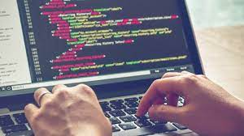

# _My first website_

#### By _**Liam Campbell**_  

#### This application will allow me to practice building websites while applying different html and css styling elements.

## Technologies Used

* Github
* CSS
* html

## Description

### This applicationis my first, I made it to practice building websites while applying different css styling elements. In my first website I practice using different elements such as h1, as well as basic html practice. In index.html I practice inserting images, and in my-favorite-place.html I use the opportunity to describe some of my favorite places while practicing css styling an html page.

## Setup/Installation Requirements

* Navigate to your desktop in the terminal. 
* $ git clone https://github.com/lcmpbll/my-first-website
* $code .

## Known Bugs

* _This is still a work in progress, I am still learning._

## License

_Feel free to reach out with any questions or comments._

[Copyright](LICENSE) (c) _5/26/22_ _Liam Campbell_
